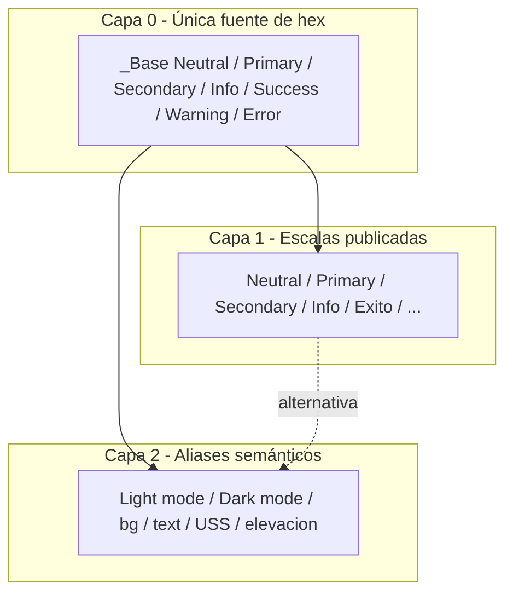

# Color Token Binding Plan

Plan para conectar aliases semánticos de Color a tokens primitivos en `tokens.json`, eliminando valores hex absolutos. Origen: análisis del set Color (agosto 2026).

## Objetivo

Sustituir valores crudos (`#001894`) por referencias Tokens Studio (`{_Base.Primary.Primary 90}`) para que los aliases hereden de la escala primitiva y queden jerarquizados.

Hoy: **153 aliases semánticos** con hex absoluto y **0 referencias**. Tipografía ya usa `{path}`; Color debe adoptar el mismo patrón.

## Diagnóstico

| Rama | Tokens color | Rol |
|------|--------------|-----|
| `Light mode` | 66 | Alias semántico |
| `☾ Dark mode` | 67 | Alias semántico |
| `bg` | 4 | Alias semántico |
| `text` | 6 | Alias semántico |
| `USS` | 6 | Alias semántico |
| `elevacion` | 4 | Alias semántico |
| `_Base` | 75 | Primitivos (fuente de hex) |
| `Neutral` / `Primary` / `Secondary` / `Info` / `Exito` / `Alerta` / `Error` / `Facultad` / `Tono-*` | 97 | Escalas raíz (también hex hoy) |

Metadata: `$themes` vacío; `$metadata.tokenSetOrder`: Color → Tipografia → Elevacion → Space → Radius.

### Matching hex → `_Base`

| Grupo | Tokens | Match `_Base` | Sin match |
|------|--------|---------------|-----------|
| Light + Dark | 133 | ~129 | 4 |
| bg / text / USS / elevacion | 20 | mayoría | facultad + elevacion + alphas |
| **Total semántico** | **153** | **~149** | **~4–8** |

- Semantic raw hex: 153
- Semantic refs: 0
- Unique hex en semánticos: 51
- Unique hex unmatched: 4 (`#d0dde6`, `#d9dced`, `#ffffff00`, `#0b141f00`)
- Match only `_Base`: 12 · only root prim: 5 · both: 132

## Jerarquía propuesta



- **Capa 0:** único lugar con hex → `Color._Base.*`
- **Capa 1:** escalas raíz como aliases de `_Base` (o deprecación a medio plazo)
- **Capa 2:** aliases semánticos solo con referencias `{...}`

## Fase 0 — Decisiones (bloquear antes de editar)

1. **Fuente canónica:** `_Base` es el único lugar con hex.
2. **Drift Neutral 82 / 85 / 88** — **cerrado:** gana `_Base`. Raíz aliasa `_Base`; `elevacion.on-dark` hereda Neutral 88 (`#1d2633`).

   | Step | Canónico (`_Base`) | Raíz e elevation dejan de usar |
   |------|--------------------|--------------------------------|
   | 88 | `#1d2633` | `#121c27` |
   | 85 | `#202a37` | `#192330` |
   | 82 | `#242f3c` | `#212b38` |

3. **Formato de referencia** (igual que Tipografía): `{_Base.Neutral.Neutral 20}` dentro del set `Color`. Paths exactos, incluyendo espacios, paréntesis y emoji.
4. **Alcance:** `Light mode`, `☾ Dark mode`, `bg`, `text`, `USS`, `elevacion` (no solo light/dark).

## Fase 1 — Inventario y casos especiales

Usar matching de hex contra `_Base`. Descriptions existentes (`Primary 70`, `Neutral 100`) son hints; validar contra el hex.

### Sin match / excepciones

| Token | Valor | Tratamiento |
|-------|--------|-------------|
| `Light mode.Background.Background 3` | `#d0dde6` | `{_Base.Secondary - Verde.Secondary 10}` (`#edf8f8`; cambia) |
| `Light mode.Background.Background 4` | `#d9dced` | `{_Base.Secondary - Verde.Secondary 20}` (`#d2e4e4`; cambia) |
| `☾ Dark mode.Background.Background 3` | `#071d27` | `{_Base.Secondary - Verde.Secondary 100}` (ya coincide) |
| `☾ Dark mode.Background.Background 4` | — | **Crear** → `{_Base.Secondary - Verde.Secondary 90}` (`#114252`) |
| `Light mode.Surface.Surface ghost - default` | `#ffffff00` | `{_Base.Transparent}` (`#00000000`; no `rgba({ref},0)`) |
| `☾ Dark mode.Surface.☾ Surface ghost - default` | `#0b141f00` | `{_Base.Transparent}` |
| `text.facultad.on-light.primary` | `#293f56` | `{Facultad.on-light.A}` → `{_Base.Facultad.on-light.A}` |
| `elevacion.on-dark.1–4` | `#121c27` | `{_Base.Neutral.Neutral 88}` (`#1d2633`) |

## Fase 2 — Normalizar primitivos

1. Dejar hex **solo** en `_Base`.
2. Convertir escalas raíz a aliases:

   ```json
   "Primary": {
     "90": {
       "value": "{_Base.Primary.Primary 90}",
       "type": "color"
     }
   }
   ```

3. Mapear naming paralelo: `_Base.Success` ↔ `Exito`, `_Base.Warning` ↔ `Alerta`.
4. No tocar Tipografía / Elevación / Space / Radius en este trabajo.

## Fase 3 — Reescribir aliases semánticos

```json
"Surface strong - default": {
  "value": "{_Base.Primary.Primary 90}",
  "type": "color"
}
```

Orden (bajo riesgo → alto):

1. `USS`, `bg`, `text`
2. `Light mode` (Background → Surface → Border → Text → … → Buttons)
3. `☾ Dark mode` (misma estructura)
4. `elevacion` (después del fix Neutral 88)

### Ejemplos resueltos por valor

- `Light mode.Text.Strong` `#0b141f` → `{_Base.Neutral.Neutral 100}`
- `Light mode.Links.Default` `#001894` → `{_Base.Primary.Primary 90}`
- `☾ Dark mode.Buttons.☾ Primario hover` `#93a3f7` → `{_Base.Primary.Primary 40}`

## Fase 4 — Validación

1. Ningún alias semántico con hex (salvo whitelist de excepciones).
2. Valor resuelto === hex original (regresión visual = 0).
3. Sin ciclos (`A → B → A`).
4. Smoke Tokens Studio / export: CSS de aliases apunta a variables de `_Base`.

## Fase 5 — Entrega

1. Diff de `tokens.json` + tabla alias → primitivo.
2. Nota en README: hex solo en `_Base`; semánticos usan `{...}`.
3. Opcional: sync Figma Variables si el archivo se publica desde Tokens Studio.

## Riesgos

- **Drift Neutral 82/85/88:** bindear sin alinear cambia dark elevation.
- **Nombres con espacios/emoji:** refs deben coincidir exactas con el path.
- **Alpha en ghost surfaces:** cerrado. Primitivo `_Base.Transparent` `#00000000`; alias `{_Base.Transparent}`. `rgba({path}, 0)` no es color DTCG válido.
- **Duplicidad `_Base` vs escalas raíz:** si no se bindean las escalas, el kit sigue con dos verdades.

## Orden de ejecución

1. Decidir facultad `#293f56` (Neutral/BG/ghost cerrados).
2. Script de auto-replace hex → path `_Base`.
3. Revisión manual de ambigüedades (mismo hex en dos primitivos; hoy es raro).
4. Bindear escalas raíz → `_Base`.
5. Validar resolve + export.

---

## Mapa de binding semántico → `_Base`

Preferir el primer match en `_Base`. Ghost default → `{_Base.Transparent}`.

### Light mode

| Alias | Hex | Binding |
|-------|-----|---------|
| Background.Background 1 | `#ffffff` | `{_Base.Neutral.Neutral 10 (blanco)}` |
| Background.Background 2 | `#f6f7f7` | `{_Base.Neutral.Neutral 20}` |
| Background.Background 3 | `#d0dde6` | `{_Base.Secondary - Verde.Secondary 10}` |
| Background.Background 4 | `#d9dced` | `{_Base.Secondary - Verde.Secondary 20}` |
| Surface.Surface ghost - default | `#ffffff00` | `{_Base.Transparent}` |
| Surface.Surface ghost - hover | `#e4e8fc` | `{_Base.Primary.Primary 20}` |
| Surface.Surface ghost - active | `#f4f5fd` | `{_Base.Primary.Primary 10}` |
| Surface.Surface - default | `#e4e8fc` | `{_Base.Primary.Primary 20}` |
| Surface.Surface - hover | `#c5cdf9` | `{_Base.Primary.Primary 30}` |
| Surface.Surface - active | `#f4f5fd` | `{_Base.Primary.Primary 10}` |
| Surface.Surface strong - default | `#001894` | `{_Base.Primary.Primary 90}` |
| Surface.Surface strong - hover | `#0024db` | `{_Base.Primary.Primary 70}` |
| Surface.Surface strong - active | `#001894` | `{_Base.Primary.Primary 90}` |
| Surface.Surface disabled | `#f6f7f7` | `{_Base.Neutral.Neutral 20}` |
| Border.Strong | `#888e96` | `{_Base.Neutral.Neutral 60}` |
| Border.Default | `#c3c5ca` | `{_Base.Neutral.Neutral 50}` |
| Border.Subtle | `#d4d6d9` | `{_Base.Neutral.Neutral 40}` |
| Border.Interactive | `#001894` | `{_Base.Primary.Primary 90}` |
| Border.Interactive subtle | `#c5cdf9` | `{_Base.Primary.Primary 30}` |
| Border.Disabled | `#c3c5ca` | `{_Base.Neutral.Neutral 50}` |
| Text.Strong | `#0b141f` | `{_Base.Neutral.Neutral 100}` |
| Text.Subtle | `#58616e` | `{_Base.Neutral.Neutral 70}` |
| Text.Inverse | `#ffffff` | `{_Base.Neutral.Neutral 10 (blanco)}` |
| Links.Default | `#001894` | `{_Base.Primary.Primary 90}` |
| Links.Hover | `#0024db` | `{_Base.Primary.Primary 70}` |
| Links.Visited | `#5e77f8` | `{_Base.Primary.Primary 50}` |
| Text interactive.Default | `#001894` | `{_Base.Primary.Primary 90}` |
| Text interactive.Hover | `#0024db` | `{_Base.Primary.Primary 70}` |
| Text interactive.Active | `#001eb8` | `{_Base.Primary.Primary 80}` |
| Text interactive.Subtle - default | `#58616e` | `{_Base.Neutral.Neutral 70}` |
| Text interactive.Subtle - hover | `#001894` | `{_Base.Primary.Primary 90}` |
| Text interactive.Subtle - active | `#001eb8` | `{_Base.Primary.Primary 80}` |
| Text interactive.Disabled | `#c3c5ca` | `{_Base.Neutral.Neutral 50}` |
| Text interactive.Inverse - default | `#e4e8fc` | `{_Base.Primary.Primary 20}` |
| Text interactive.Inverse - hover | `#f4f5fd` | `{_Base.Primary.Primary 10}` |
| Text interactive.Inverse - active | `#e4e8fc` | `{_Base.Primary.Primary 20}` |
| Icons.Strong | `#0b141f` | `{_Base.Neutral.Neutral 100}` |
| Icons.Subtle | `#58616e` | `{_Base.Neutral.Neutral 70}` |
| Icons.Decorativo | `#5aa5a5` | `{_Base.Secondary - Verde.Secondary 50}` |
| Icons.Inverse | `#ffffff` | `{_Base.Neutral.Neutral 10 (blanco)}` |
| Feedback.Text info | `#00628d` | `{_Base.Info.Info 80}` |
| Feedback.Text info strong | `#002b41` | `{_Base.Info.Info 100}` |
| Feedback.Text success | `#007350` | `{_Base.Success.Success 90}` |
| Feedback.Text success strong | `#004438` | `{_Base.Success.Success 100}` |
| Feedback.Text warning | `#836100` | `{_Base.Warning.Warning 90}` |
| Feedback.Text warning strong | `#452c00` | `{_Base.Warning.Warning 100}` |
| Feedback.Text error | `#9d0000` | `{_Base.Error.Error 80}` |
| Feedback.Text error strong | `#450000` | `{_Base.Error.Error 100}` |
| Feedback.Surface info | `#e1eef8` | `{_Base.Info.Info 20}` |
| Feedback.Surface info strong | `#0073a0` | `{_Base.Info.Info 70}` |
| Feedback.Surface success | `#e1f9ee` | `{_Base.Success.Success 20}` |
| Feedback.Surface success strong | `#00a85c` | `{_Base.Success.Success 70}` |
| Feedback.Surface warning | `#ffffbe` | `{_Base.Warning.Warning 30}` |
| Feedback.Surface warning strong | `#f4cb00` | `{_Base.Warning.Warning 70}` |
| Feedback.Surface error | `#fae4e1` | `{_Base.Error.Error 20}` |
| Feedback.Surface error strong | `#b22000` | `{_Base.Error.Error 70}` |
| Feedback.Surface neutral | `#dfe0e3` | `{_Base.Neutral.Neutral 30}` |
| Feedback.Surface neutral inverse | `#38424f` | `{_Base.Neutral.Neutral 77}` |
| Focus.Focus | `#001eb8` | `{_Base.Primary.Primary 80}` |
| Focus.Inverse | `#e4e8fc` | `{_Base.Primary.Primary 20}` |
| Buttons.Primario default | `#001894` | `{_Base.Primary.Primary 90}` |
| Buttons.Primario hover | `#0024db` | `{_Base.Primary.Primary 70}` |
| Buttons.Primario active | `#001eb8` | `{_Base.Primary.Primary 80}` |
| Buttons.Secundario default | `#e4e8fc` | `{_Base.Primary.Primary 20}` |
| Buttons.Secundario hover | `#c5cdf9` | `{_Base.Primary.Primary 30}` |
| Buttons.Secundario active | `#f4f5fd` | `{_Base.Primary.Primary 10}` |

### Dark mode

| Alias | Hex | Binding |
|-------|-----|---------|
| Background.Background 1 | `#0b141f` | `{_Base.Neutral.Neutral 100}` |
| Background.Background 2 | `#19222e` | `{_Base.Neutral.Neutral 90}` |
| Background.Background 3 | `#071d27` | `{_Base.Secondary - Verde.Secondary 100}` |
| Background.Background 4 | — (crear) | `{_Base.Secondary - Verde.Secondary 90}` |
| Surface.☾ Surface ghost - default | `#0b141f00` | `{_Base.Transparent}` |
| Surface.☾ Surface ghost - hover | `#38424f` | `{_Base.Neutral.Neutral 77}` |
| Surface.☾ Surface ghost - active | `#283341` | `{_Base.Neutral.Neutral 80}` |
| Surface.☾ Surface - default | `#38424f` | `{_Base.Neutral.Neutral 77}` |
| Surface.☾ Surface - hover | `#283341` | `{_Base.Neutral.Neutral 80}` |
| Surface.☾ Surface - active | `#48515d` | `{_Base.Neutral.Neutral 73}` |
| Surface.☾ Surface strong - default | `#c5cdf9` | `{_Base.Primary.Primary 30}` |
| Surface.☾ Surface strong - hover | `#e4e8fc` | `{_Base.Primary.Primary 20}` |
| Surface.☾ Surface strong - active | `#c5cdf9` | `{_Base.Primary.Primary 30}` |
| Surface.☾ Surface disabled | `#283341` | `{_Base.Neutral.Neutral 80}` |
| Border.☾ Strong | `#888e96` | `{_Base.Neutral.Neutral 60}` |
| Border.☾ Default | `#58616e` | `{_Base.Neutral.Neutral 70}` |
| Border.☾ Subtle | `#283341` | `{_Base.Neutral.Neutral 80}` |
| Border.☾ Interactive | `#93a3f7` | `{_Base.Primary.Primary 40}` |
| Border.☾ Interactive subtle | `#888e96` | `{_Base.Neutral.Neutral 60}` |
| Border.☾ disabled | `#58616e` | `{_Base.Neutral.Neutral 70}` |
| Text.☾ Strong | `#dfe0e3` | `{_Base.Neutral.Neutral 30}` |
| Text.☾ Subtle | `#c3c5ca` | `{_Base.Neutral.Neutral 50}` |
| Text.☾ Inverse | `#0b141f` | `{_Base.Neutral.Neutral 100}` |
| Links.☾ Default | `#e4e8fc` | `{_Base.Primary.Primary 20}` |
| Links.☾ Hover | `#93a3f7` | `{_Base.Primary.Primary 40}` |
| Links.☾ Visited | `#5e77f8` | `{_Base.Primary.Primary 50}` |
| Text interactive.☾ Default | `#e4e8fc` | `{_Base.Primary.Primary 20}` |
| Text interactive.☾ Hover | `#93a3f7` | `{_Base.Primary.Primary 40}` |
| Text interactive.☾ Active | `#c5cdf9` | `{_Base.Primary.Primary 30}` |
| Text interactive.☾ Subtle default | `#c3c5ca` | `{_Base.Neutral.Neutral 50}` |
| Text interactive.☾ Subtle - hover | `#93a3f7` | `{_Base.Primary.Primary 40}` |
| Text interactive.☾ Subtle - active | `#c5cdf9` | `{_Base.Primary.Primary 30}` |
| Text interactive.☾ Inverse default | `#001eb8` | `{_Base.Primary.Primary 80}` |
| Text interactive.☾ Inverse - hover | `#0024db` | `{_Base.Primary.Primary 70}` |
| Text interactive.☾ Inverse - active | `#001eb8` | `{_Base.Primary.Primary 80}` |
| Text interactive.☾ Disabled | `#58616e` | `{_Base.Neutral.Neutral 70}` |
| Icons.☾ Strong | `#dfe0e3` | `{_Base.Neutral.Neutral 30}` |
| Icons.☾ Subtle | `#c3c5ca` | `{_Base.Neutral.Neutral 50}` |
| Icons.☾ Decorativo | `#8ebfbf` | `{_Base.Secondary - Verde.Secondary 40}` |
| Icons.☾ Inverse | `#0b141f` | `{_Base.Neutral.Neutral 100}` |
| Feedback.☾ Text info | `#bedbee` | `{_Base.Info.Info 30}` |
| Feedback.☾ Text info strong | `#bedbee` | `{_Base.Info.Info 30}` |
| Feedback.☾ Text success | `#57cf98` | `{_Base.Success.Success 50}` |
| Feedback.☾ Text success strong | `#57cf98` | `{_Base.Success.Success 50}` |
| Feedback.☾ Text warning | `#f4cb00` | `{_Base.Warning.Warning 70}` |
| Feedback.☾ Text warning strong | `#f4cb00` | `{_Base.Warning.Warning 70}` |
| Feedback.☾ Text error | `#e7978a` | `{_Base.Error.Error 40}` |
| Feedback.☾ Text error strong | `#e7978a` | `{_Base.Error.Error 40}` |
| Feedback.☾ Surface info | `#002b41` | `{_Base.Info.Info 100}` |
| Feedback.☾ Surface info strong | `#002b41` | `{_Base.Info.Info 100}` |
| Feedback.☾ Surface success | `#004438` | `{_Base.Success.Success 100}` |
| Feedback.☾ Surface success strong | `#004438` | `{_Base.Success.Success 100}` |
| Feedback.☾ Surface warning | `#452c00` | `{_Base.Warning.Warning 100}` |
| Feedback.☾ Surface warning strong | `#452c00` | `{_Base.Warning.Warning 100}` |
| Feedback.☾ Surface error | `#450000` | `{_Base.Error.Error 100}` |
| Feedback.☾ Surface error strong | `#450000` | `{_Base.Error.Error 100}` |
| Feedback.☾ Surface neutral | `#38424f` | `{_Base.Neutral.Neutral 77}` |
| Feedback.☾ Surface neutral inverse | `#dfe0e3` | `{_Base.Neutral.Neutral 30}` |
| Elevation (reemplazo a sombra).☾ Elevation 1 | `#202a37` | `{_Base.Neutral.Neutral 85}` |
| Elevation (reemplazo a sombra).☾ Elevation 2 | `#242f3c` | `{_Base.Neutral.Neutral 82}` |
| Focus.Focus | `#e4e8fc` | `{_Base.Primary.Primary 20}` |
| Focus.Inverse | `#001eb8` | `{_Base.Primary.Primary 80}` |
| Buttons.☾ Primario default | `#c5cdf9` | `{_Base.Primary.Primary 30}` |
| Buttons.☾ Primario hover | `#93a3f7` | `{_Base.Primary.Primary 40}` |
| Buttons.☾ Primario active | `#e4e8fc` | `{_Base.Primary.Primary 20}` |
| Buttons.☾ Secundario default | `#38424f` | `{_Base.Neutral.Neutral 77}` |
| Buttons.☾ Secundario hover | `#283341` | `{_Base.Neutral.Neutral 80}` |
| Buttons.☾ Secundario active | `#48515d` | `{_Base.Neutral.Neutral 73}` |

### bg / text / USS / elevacion

| Alias | Hex | Binding | Hint en description |
|-------|-----|---------|---------------------|
| bg.on-dark.primary | `#0b141f` | `{_Base.Neutral.Neutral 100}` | Neutral 100 |
| bg.on-dark.secondary | `#f6f7f7` | `{_Base.Neutral.Neutral 20}` | Neutral 20 |
| bg.on-light.primary | `#ffffff` | `{_Base.Neutral.Neutral 10 (blanco)}` | — |
| bg.on-light.secondary | `#f6f7f7` | `{_Base.Neutral.Neutral 20}` | — |
| text.facultad.on-light.primary | `#293f56` | `{Facultad.on-light.A}` | — |
| text.facultad.on-light.secondary | `#58616e` | `{_Base.Neutral.Neutral 70}` | — |
| text.on-light.primary | `#0b141f` | `{_Base.Neutral.Neutral 100}` | — |
| text.on-light.secondary | `#58616e` | `{_Base.Neutral.Neutral 70}` | — |
| text.on-dark.primary | `#ffffff` | `{_Base.Neutral.Neutral 10 (blanco)}` | neutral 10 |
| text.on-dark.secondary | `#f6f7f7` | `{_Base.Neutral.Neutral 20}` | neutral 20 |
| USS.on-light.A | `#001370` | `{_Base.Primary.Primary 100}` | primary 100 |
| USS.on-light.B | `#001eb8` | `{_Base.Primary.Primary 80}` | Primary 80 |
| USS.on-light.C | `#0024db` | `{_Base.Primary.Primary 70}` | Primary 70 |
| USS.on-dark.A | `#f4f5fd` | `{_Base.Primary.Primary 10}` | Primary 10 |
| USS.on-dark.B | `#e4e8fc` | `{_Base.Primary.Primary 20}` | Primary 20 |
| USS.on-dark.C | `#93a3f7` | `{_Base.Primary.Primary 40}` | Primary 40 |
| elevacion.on-dark.1–4 | `#121c27` | `{_Base.Neutral.Neutral 88}` (`#1d2633`) | Neutral 88 |
